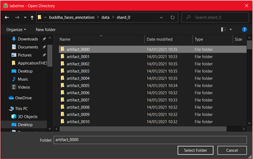
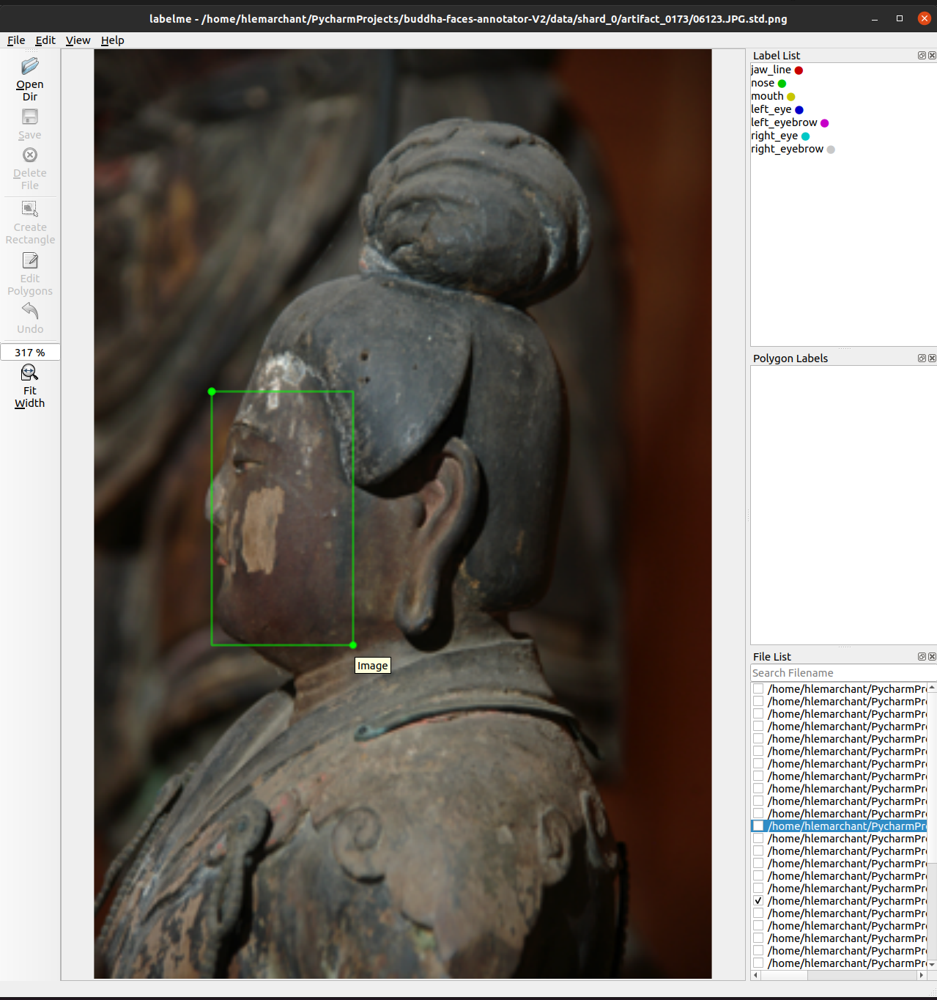
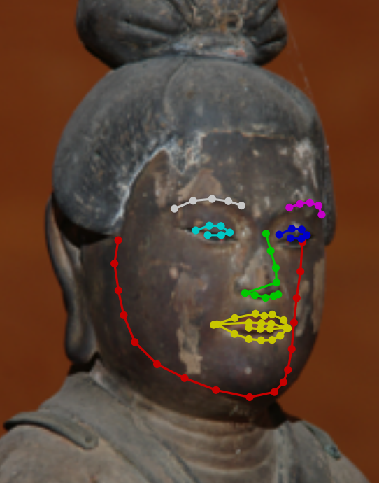
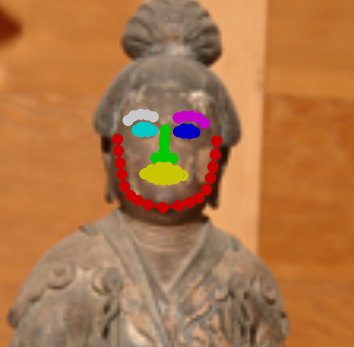
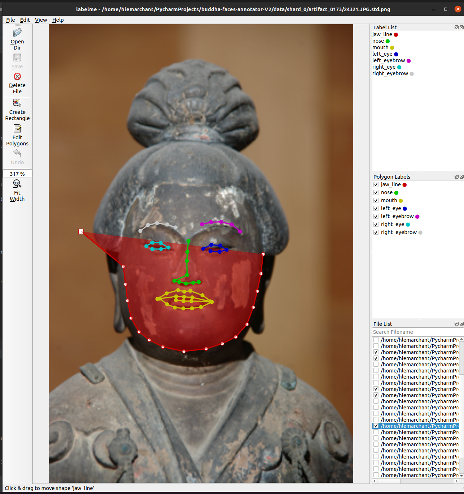
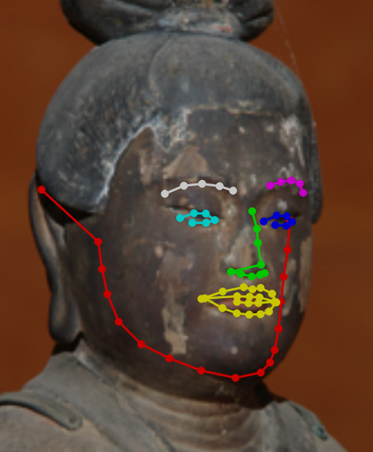
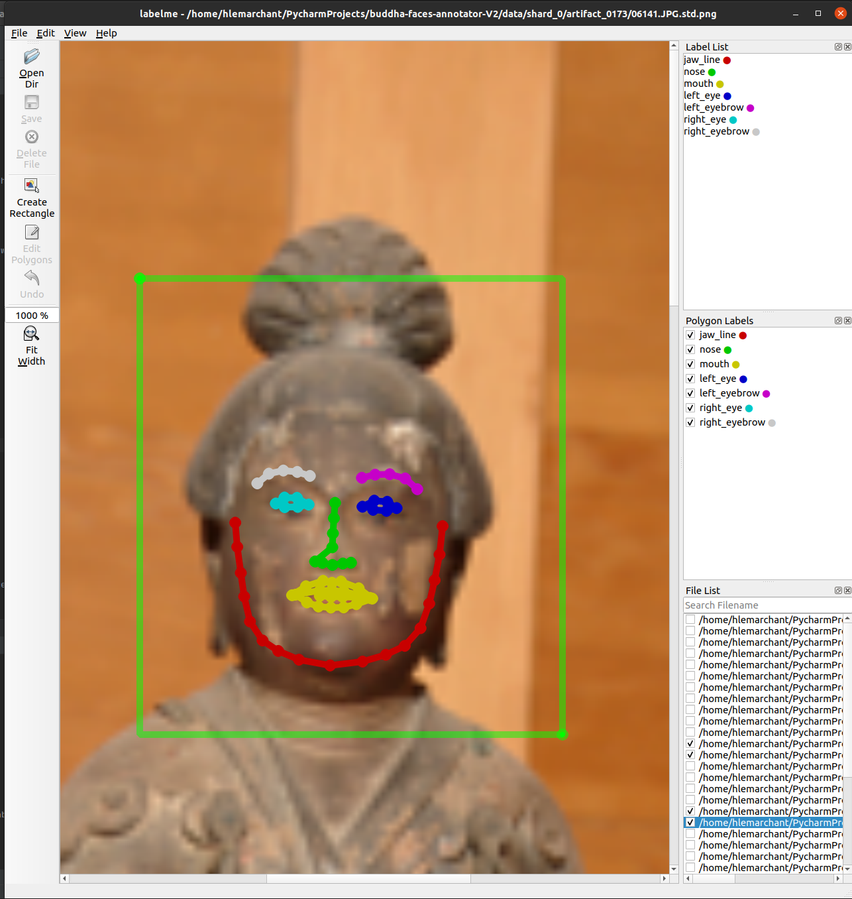
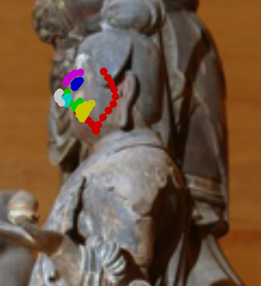

仏顔のアノテーションのやり方
=========================

目的
=======

このアノテーションでは、仏像の顔のランドマーク点（顔輪郭目鼻口など）の自動抽出のためのデータを作成していただきます。同じ仏像に対して、何枚かの画像でランドマーク点をつけることで、3次元の点の位置を求めることができるようになります。顔を囲む矩形を与えることでランドマーク点の大体の位置が与えられますが、この大体の位置から一番適切と思われる位置に修正してください。

======

You will find the project in a Google Drive folder at this link:

https://drive.google.com/drive/folders/1Zz4YJfn-WtoTnjCfWkFR4U6e9q7yckBs?usp=sharing

Please download the project buddha_faces_annotation folder on your computer and copy it wherever you want (Desktop, 
Download, Documents, etc). \
Double-click on it once it’s downloaded. You will find a file "data.zip", right click on it and select "Extract here". 
(double-click for MacOSX users)\
While it's downloading, please create a folder with your name in the Google Drive, next to the "Shards tracking" file.
It will be used for you to send your annotations.

Then depending on your Operating System:

-   For Windows:
        
    a.  Double-click the file "WINDOWSlabelme.bat"
        
    b.  You might be asked to press [y] and Enter a couple of times
        the first time you open the project, please do so

-   For Linux (Ubuntu, Debian, etc…):

    a.  Right click inside the folder and click “Open in Terminal”
    
    b.  Copy or type: ./LINUXlabelme.sh
        
    c.  Then press Enter
        
    d.  You might be asked to press [y] and Enter a couple of times
            the first time you open the project, please do so

-   For MacOSX:

    a.  Right click the file MacOSXlabelme.sh
    
    b.  Click “Open with” and then “Other…”
    
    c.  Click “All Applications” and select “Terminal”
    
    d.  Make sure “Always Open With” is not checked
    
    e.  Validate with “OK”
    
    f.  Then double-click the file MacOSX.sh
    
    g.  You might be asked to press [y] and Enter a couple of times the
        first time you open the project, please do so

When everything is finished you should have this window opened (don’t
hesitate to make it in full screen):

You are now ready to start the annotation.

Getting started
===============

To start annotating click “Open Dir” button, a dialogue window will
appear where the data is located. Here the folders are named
“shard\_XX”. They contain 100 artifacts each. When you start annotating
a new shard please select your name/id/pseudo in the corresponding
column on the Google Sheets file called “Shards tracking”:

https://drive.google.com/drive/folders/1Zz4YJfn-WtoTnjCfWkFR4U6e9q7yckBs?usp=sharing

Do not annotate a shard already started by another annotator.

Once you have a new shard at your name double-click that folder and
select any folder inside, they will be named “artifact_XXXX”.

Click “Select folder” when you have selected the desired artifact.

Navigate through the images of the artifact by clicking on their name in the "File List" box in the bottom right corner:

Click the “Create Rectangle” tool, and place two points (two clicks) to
create a box that contain fully the face. You should make the most tight box that contains the chin and eyebrows.
Do not annotate the faces with a view larger than 90°.

Then a dialogue box should appear, simply type “detect” in the field
“Enter object label” and click “OK”.

Then the first estimation of landmarks will appear:

Go through each image and repeat this procedure.

Once all the available faces have been detected, you will have to modify the points that are not correctly detected.\
First click the button "Edit Polygons" to quite the rectangle creation mode. (You can between these modes as much as 
you want)\
Now go to any picture where a detection was made and click on any point. Maintaining the click will allow you 
to move that point freely.\
You can do the same with an entire shape if you select the colored area between the points.\
These modifications are saved independently of the view so deleting the current view's annotation will not revert the 
changes made. However, you can cancel a modification with "Ctrl" + Z, as long as you do not change of image.\
The modifications will be reported to the other views, so you will need to correct the same point in several views to 
have the correct 3D annotation.

You can zoom in and out the image maintaining "Ctrl" and using the scroll wheel of the mouse.

Please do not trace multiple rectangles in one view, if this situation happens, press "Esc" to cancel the creation:

If the display is way too far from the image, please change briefly of image to enable the button "Delete File" and 
delete the file. You will then be able to select any file. Note that this only delete the annotations, not the image, so
it's up to you not to try to annotate it again.

Finishing an artifact and a shard
=================================

When all the images of an artifact are annotated, repeat the steps to “Open Dir” for the next artifact in your 
current shard.
Before quiting the application, change briefly the displayed image to save your last modifications.

When all the artifacts of a shard are annotated go to the directory of the project, then drag and drop the folder 
named "annotations" shard in Google Drive, inside the folder you created with your name. 
(https://drive.google.com/drive/folders/1Zz4YJfn-WtoTnjCfWkFR4U6e9q7yckBs?usp=sharing).

Then get a new shard at your name.

Thank you for your implication 😃

Hugo
