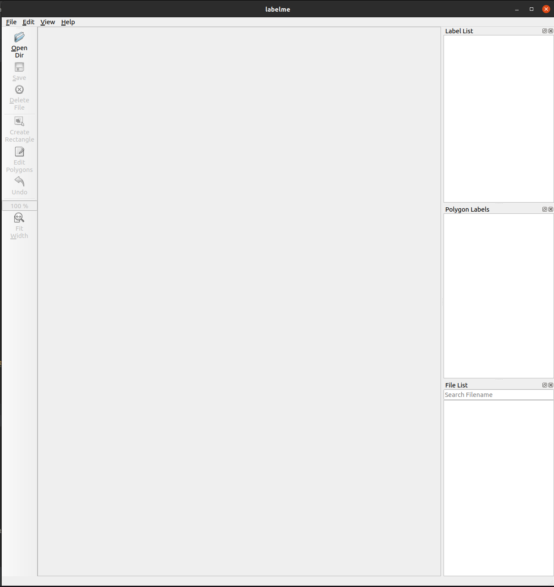
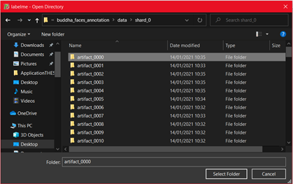
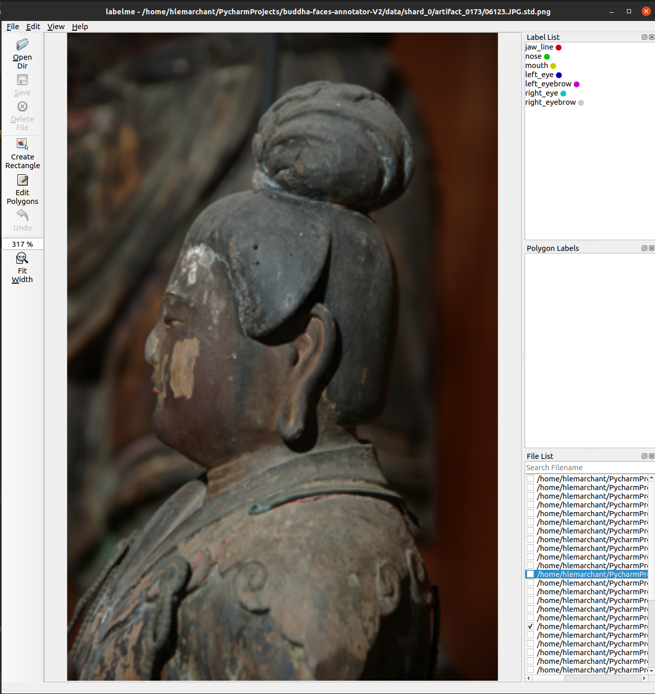
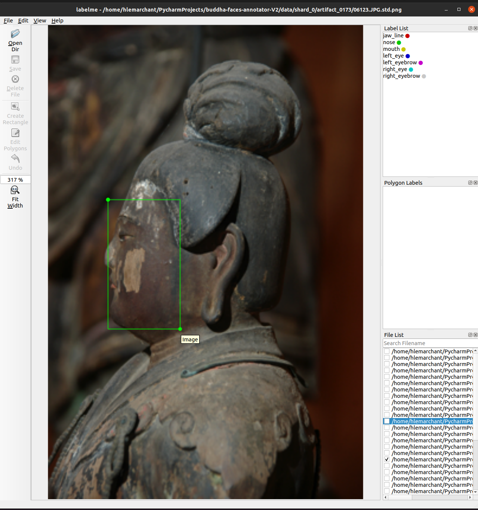
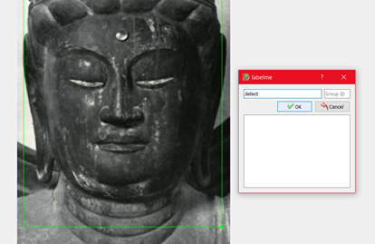
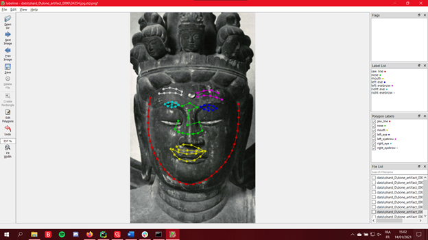
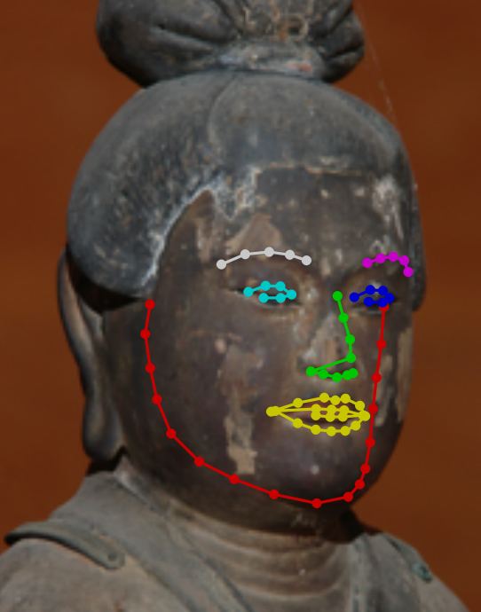
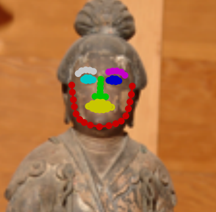
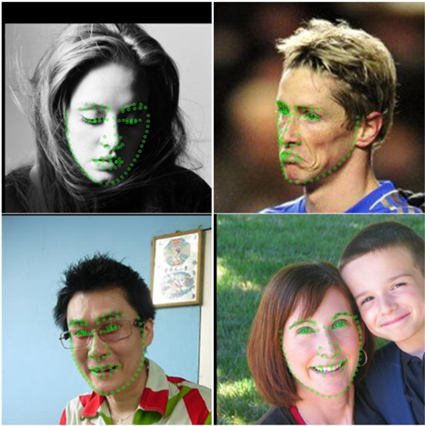
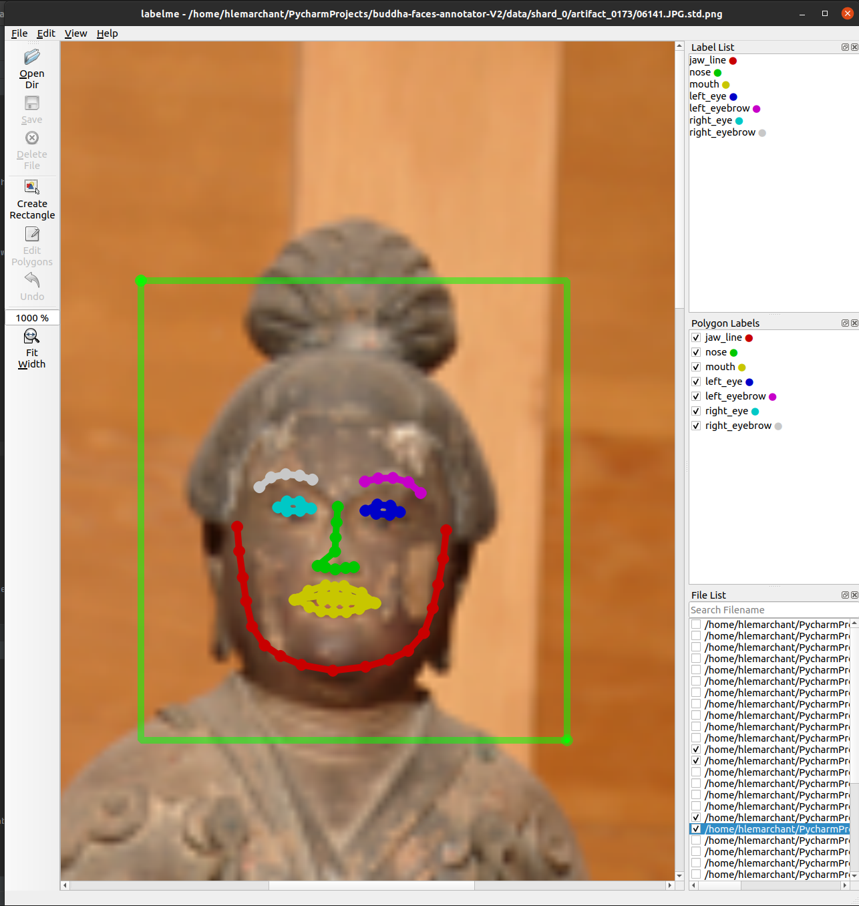

Buddha faces annotation
=========================

Purpose
=======

This annotation aims to refine already existing facial landmarks, to
make them specifically efficient for facial landmarks detection on
Buddha statues.

You will be provided an application modified by Hugo to refine the
landmarks that can be already detected.

Set up
======

You will find the project in a Google drive folder at this link:

[https://drive.google.com/drive/folders/1Zz4YJfn-WtoTnjCfWkFR4U6e9q7yckBs?usp=sharing](../../../../../tmp/mozilla_hlemarchant0/%20https://drive.google.com/drive/folders/1Zz4YJfn-WtoTnjCfWkFR4U6e9q7yckBs%3Fusp=sharing)

Please download the compressed project buddha\_faces\_annotation.zip on
your computer and copy it wherever you want (Desktop, Download,
Documents, etc). Please unzip it and double click on it once it’s ready.

Then depending on your Operating System:

-   For Windows:

1.  a.  Click “File” -&gt; “Open Windows Powershell”
    b.  Copy or type: ./WINDOWSlabelme.bat
    c.  Then press Enter
    d.  You might be asked to press \[y\] and Enter a couple of times
        the first time you open the project, please do so

-   For Linux (Ubuntu, Debian, etc…) :

1.  a.  Right click inside the folder and click “Open in Terminal”
    b.  Copy or type: ./LINUXlabelme.sh
    c.  Then press Enter
    d.  You might be asked to press \[y\] and Enter a couple of times
        the first time you open the project, please do so

-   For MacOSX:

a.  Right click the file MacOSXlabelme.sh
b.  Click “Open with” and then “Other…”
c.  Click “All Applications” and select “Terminal”
d.  Make sure “Always Open With” is not checked
e.  Validate with “OK”
f.  Then double-click the file MacOSX.sh
g.  You might be asked to press \[y\] and Enter a couple of times the
    first time you open the project, please do so

When everything is finished you should have this window opened (don’t
hesitate to make it in full screen):

You are now ready to start the annotation.

Getting started
===============

To start annotating click “Open Dir” button, a dialogue window will
appear where the data is located. Here the folders are named
“shard\_XX”. They contain 100 artifacts each. When you start annotating
a new shard please select your name/id/pseudo in the corresponding
column on the Google Sheets file called “Shards tracking”:

[https://drive.google.com/drive/folders/1Zz4YJfn-WtoTnjCfWkFR4U6e9q7yckBs?usp=sharing](../../../../../tmp/mozilla_hlemarchant0/%20https://drive.google.com/drive/folders/1Zz4YJfn-WtoTnjCfWkFR4U6e9q7yckBs%3Fusp=sharing)

Do not annotate a shard already started by another annotator.

Once you have a new shard at your name double-click that folder and
select any folder inside, they will be named “artifact\_XXXX” if you
never opened it before, “done\_artifact\_XXXX” otherwise.

Click “Select folder” when you have selected the desired artifact.

Navigate through the images of the artifact, when you see an image with
the (main) face of that artifact:

Click the “Create Rectangle” tool, and place two points (two clicks) to
create a box that contain fully the face. You can include a large
portion of the picture and the statue; the precision is not required at
this stage. Make sure the entire face is inside the box.

Then a dialogue box should appear, simply type “detect” in the field
“Enter object label” and click “OK”.

Then the first estimation of landmarks will appear:

As shown here the landmarks do not fit exactly the face. You will be
asked to move each point to the correct location the more accurately
possible.

Finishing an artifact and a shard
=================================

When all the images of an artifact are annotated, repeat the steps to
“Open Dir” for the next artifact in your current shard.

When all the artifacts of a shard are annotated go to the directory of
the project, then open the directory called “data”, you will find the
shards here. Drag and drop the finished shard in Google Drive ([
https://drive.google.com/drive/folders/1Zz4YJfn-WtoTnjCfWkFR4U6e9q7yckBs?usp=sharing](../../../../../tmp/mozilla_hlemarchant0/%20https://drive.google.com/drive/folders/1Zz4YJfn-WtoTnjCfWkFR4U6e9q7yckBs%3Fusp=sharing)).

Then get a new shard at your name.

Thank you for your implication 😃

Hugo
